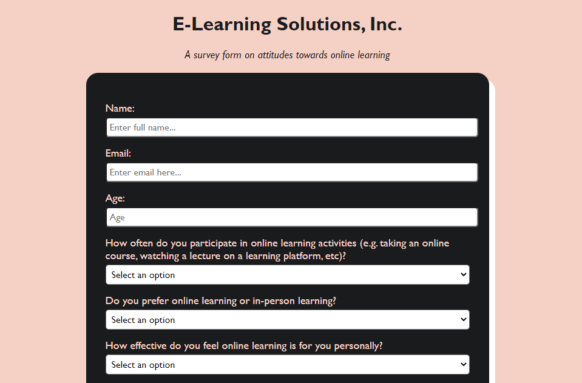

# E-Learning Survey Form
This project is a survey form created using HTML and CSS. The form includes various question types. The design is fully responsive and optimized for all screen sizes.

  

## Getting Started
- Clone or download the repository to your local machine.
- Open the index.html file in a web browser to view the form.
- The CSS file can be modified to change the styling of the form.
- Or [click the link here](https://xiacodes.github.io/e-learning-survey/) to see the page now!

## Built With
- HTML
- CSS

## Acknowledgments
This project is part of FreeCodecamp's ['Responsive Web Design'](https://www.freecodecamp.org/learn/2022/responsive-web-design) course
